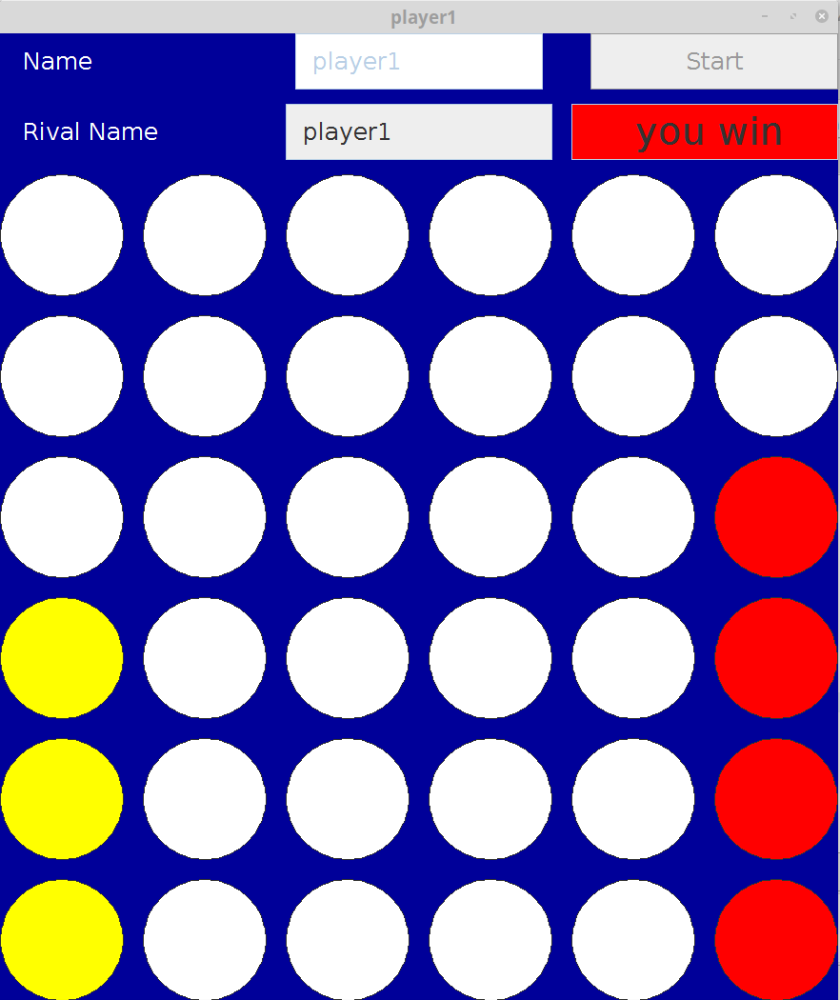

<!DOCTYPE html>
<html>
<head>
</head>
<body>
	<h1> Connect4 </h1>
	
 Client-Server Game

	<ol>
		<h2><li > Summary</li></h2>
		

			Connect Four  is a two-player connection game in which  players have tow differnt color and then take turns dropping one colored disc from the top into a seven-column, six-row(Dynamic) vertically suspended grid. The pieces fall straight down, occupying the lowest available space within the column. The objective of the game is to be the first to form a horizontal, vertical, or diagonal line of four of one's own discs.
		

		<h2><li > Project steps </li></h2>
		<ul> 
			<li> creating (6 * 7) Two-dimensional matrix  from buttons derived from CirculerButton </li>
			<li>  Adding  colum, isEmpty and color properties to buttons for control  purposes.</li>
			<li>  When the  player  press start  button he connects to the server and  the server will create a Sclient that will serve only  that player and then server will  back to wait for other players reqests.</li>
			<li> Sclient will start  PairingThread to match the player with another player</li>
			<li> when two players are matched, the game will start and different colors will be assigned to the 
				players </li>
		                <li> 
				There are two basic and continuous functions in the game</li> 
				<ol>
				<li> controling player  own moves(controled by Circular buttons ActionListener)
				</li>
				<li> Controling rival  moves (controled by control thred)</li>
				</ol>
			<li> 
				transactions when player make a move (dropping one colored disc): </li>
				<ol>
				<li> Fill method invoked  with the selected colum number and the first blank hole in that  colum will bw filled with the player color
				</li>
				<li>  horizantal, vertical and digonal  control methods will be called</li>
				<li> transiction information will sent to the rival as a message.</li>
				</ol>
			<li> when player send message to rival the message will go firstly to the sclient then to the rival</li>
			<li> game terminates if one player win or if all holes filled and players draw</li>	
		</ul>
    </ol>
</body>
	
</html>

